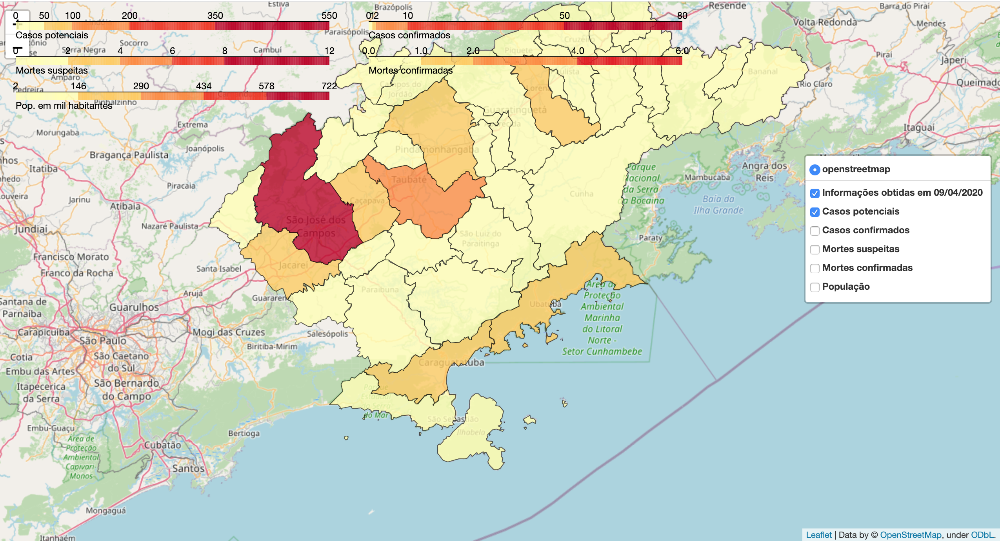

Introdução
============

Mapa
---------------

https://santos-f.github.io/covid19valemap/

Quem somos
---------------
O projeto nasceu a partir de um grupo no whatsapp, criado em 18/03/2020. Uma iniciativa particular para reunir profissionais de geociências com o objetivo de enfrentamento da pandemia de Covid19. O grupo pretende, em coletivo, pensar soluções e contribuir para a tomada de decisões. Também, divulgar metodologias de mapeamento e trabalhos realizados ou indicados pelos membros, sobre Covid19.

O foco inicial era a RMVale (região metropolitana do Vale do Paraíba e Litoral Norte), área localizada entre as duas metrópoles nacionais São Paulo e Rio de Janeiro, contudo, as redes de contatos se ampliaram e dois dias depois (20/03/2020) alcançamos um coletivo de diferentes localidades do mundo.

Diante disso, foi proposta a formação de GTs (grupos de trabalho) para monitoramento e atuação em diferentes regiões do Brasil onde o crescimento epidêmico vem crescendo. Somos vários. Cidadãos, alunos, professores de diferentes níveis escolares, pesquisadores e técnicos de todas as regiões do Brasil, e, cientificamente, atuantes em instituições como UNESP, UNIFESP, UNIVAP, UNITAU, UERR, UESPI, UFRN, UNICAMP, INPE, CEMADEN, ETEC, Escolas públicas, etc.
Para a RMVale, o levantamento de dados da Covid19 iniciou em 25/03/2020 e se atualiza diariamente.

